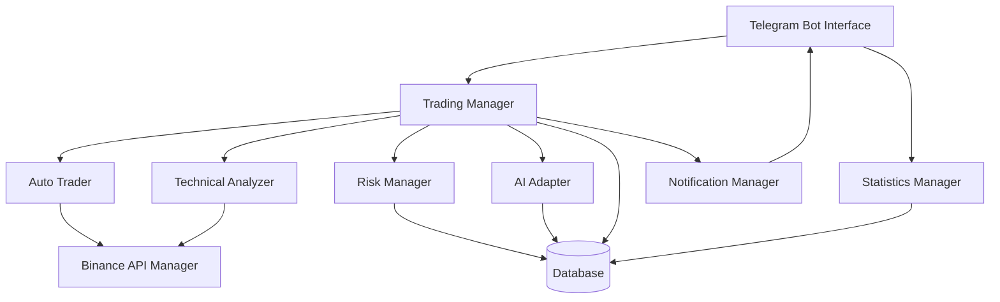
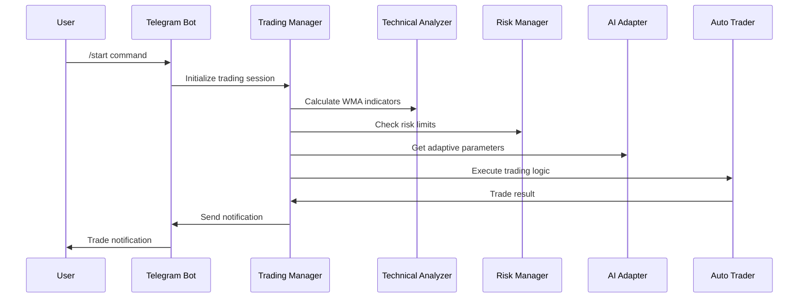

# Design Document

## Overview

The enhanced trading bot extends the existing Binance trading bot with a comprehensive Telegram interface, advanced technical analysis using WMA indicators, intelligent risk management, and AI-driven adaptive trading strategies. The design maintains the existing architecture while adding new components for user interaction, technical analysis, risk management, and machine learning capabilities.

## Architecture

### High-Level Architecture



### Component Interaction Flow



## Components and Interfaces

### 1. Telegram Bot Interface (`telegram_bot.py`)

**Purpose:** Handles all Telegram interactions, user authentication, and command processing.

**Key Methods:**

- `start_handler()`: Authenticate user and show main menu
- `status_handler()`: Display current trading status
- `stats_handler()`: Show performance statistics
- `config_handler()`: Handle configuration changes
- `stop_handler()`: Pause trading operations
- `shutdown_handler()`: Safely shutdown the bot

**Configuration:**

- Bot token from environment variable
- Authorized user IDs list
- Command rate limiting settings

### 2. Trading Manager (`trading_manager.py`)

**Purpose:** Orchestrates all trading operations, integrating technical analysis, risk management, and AI recommendations.

**Key Methods:**

- `execute_trading_cycle()`: Main trading loop with enhanced logic
- `evaluate_trade_opportunity()`: Assess trades using multiple criteria
- `apply_risk_checks()`: Validate trades against risk parameters
- `integrate_ai_recommendations()`: Apply AI-suggested adjustments

**Interfaces:**

- `ITradingManager`: Abstract interface for trading operations
- `INotificationHandler`: Interface for sending notifications

### 3. Technical Analyzer (`technical_analyzer.py`)

**Purpose:** Implements WMA calculations and technical analysis for trading decisions.

**Key Methods:**

- `calculate_wma()`: Compute weighted moving averages
- `detect_trend()`: Identify market trends using WMA
- `get_wma_signal()`: Generate buy/sell signals from WMA analysis
- `validate_historical_data()`: Ensure sufficient data for analysis

**WMA Implementation:**

- Short-term WMA (7-period default)
- Long-term WMA (21-period default)
- Crossover detection for trend changes
- Trend strength calculation

### 4. Risk Manager (`risk_manager.py`)

**Purpose:** Monitors portfolio performance and enforces risk limits.

**Key Methods:**

- `check_daily_loss_limit()`: Monitor daily loss threshold
- `calculate_portfolio_risk()`: Assess current risk exposure
- `should_halt_trading()`: Determine if trading should stop
- `reset_daily_counters()`: Reset daily tracking at midnight

**Risk Metrics:**

- Daily loss percentage tracking
- Portfolio value monitoring
- Volatility assessment
- Emergency shutdown triggers

### 5. AI Adapter (`ai_adapter.py`)

**Purpose:** Provides intelligent parameter adjustments based on market conditions and performance history.

**Key Methods:**

- `analyze_performance_patterns()`: Identify trading patterns
- `recommend_parameter_adjustments()`: Suggest optimal settings
- `assess_market_volatility()`: Evaluate current market conditions
- `update_learning_model()`: Improve recommendations over time

**AI Features:**

- Performance pattern recognition
- Dynamic parameter optimization
- Market volatility adaptation
- Conservative/aggressive mode switching

### 6. Statistics Manager (`statistics_manager.py`)

**Purpose:** Tracks and calculates comprehensive trading statistics and performance metrics.

**Key Methods:**

- `get_daily_stats()`: Calculate today's performance
- `get_weekly_stats()`: Calculate weekly performance
- `get_total_stats()`: Calculate overall performance
- `calculate_advanced_metrics()`: Compute ROI, Sharpe ratio, drawdown

**Metrics Tracked:**

- Profit/loss amounts and percentages
- Win/loss ratios
- Trade frequency
- Portfolio value changes
- Risk-adjusted returns

### 7. Enhanced Auto Trader (`enhanced_auto_trader.py`)

**Purpose:** Extends the existing AutoTrader with WMA integration and improved decision making.

**Key Enhancements:**

- WMA-based trend analysis in `_get_ratios()`
- Risk-adjusted ratio calculations
- AI-recommended parameter usage
- Enhanced logging and decision tracking

## Data Models

### New Database Tables

#### `wma_data`

```sql
CREATE TABLE wma_data (
    id INTEGER PRIMARY KEY,
    coin_id INTEGER,
    timestamp DATETIME,
    price DECIMAL(20,8),
    wma_short DECIMAL(20,8),
    wma_long DECIMAL(20,8),
    trend_signal VARCHAR(10),
    FOREIGN KEY (coin_id) REFERENCES coins(id)
);
```

#### `risk_events`

```sql
CREATE TABLE risk_events (
    id INTEGER PRIMARY KEY,
    event_type VARCHAR(50),
    description TEXT,
    portfolio_value DECIMAL(20,8),
    loss_percentage DECIMAL(5,2),
    timestamp DATETIME,
    action_taken VARCHAR(100)
);
```

#### `ai_parameters`

```sql
CREATE TABLE ai_parameters (
    id INTEGER PRIMARY KEY,
    parameter_name VARCHAR(50),
    current_value DECIMAL(10,4),
    recommended_value DECIMAL(10,4),
    confidence_score DECIMAL(3,2),
    last_updated DATETIME
);
```

#### `telegram_users`

```sql
CREATE TABLE telegram_users (
    id INTEGER PRIMARY KEY,
    telegram_id BIGINT UNIQUE,
    username VARCHAR(100),
    is_authorized BOOLEAN,
    last_activity DATETIME,
    created_at DATETIME
);
```

### Enhanced Existing Models

#### Extended `Pair` model

- Add `wma_trend_score` field
- Add `ai_adjustment_factor` field
- Add `last_wma_update` timestamp

#### Extended `CoinValue` model

- Add `daily_change_percent` field
- Add `risk_score` field

## Error Handling

### Telegram Bot Error Handling

- API rate limiting with exponential backoff
- Network connectivity error recovery
- Invalid command graceful handling
- User authentication failure logging

### Trading Error Handling

- WMA calculation failure fallback to standard logic
- Risk manager override mechanisms
- AI recommendation validation and bounds checking
- Database transaction rollback on trading errors

### Risk Management Error Handling

- Emergency shutdown on critical errors
- Portfolio value calculation error recovery
- Daily loss calculation validation
- Backup risk limit enforcement

## Testing Strategy

### Unit Testing

- **Telegram Bot**: Mock Telegram API responses, test command handlers
- **Technical Analyzer**: Test WMA calculations with known datasets
- **Risk Manager**: Test loss limit calculations and triggers
- **AI Adapter**: Test parameter recommendation logic
- **Statistics Manager**: Validate metric calculations

### Integration Testing

- **End-to-End Trading Flow**: Test complete trading cycle with all components
- **Telegram Integration**: Test bot commands with actual Telegram API
- **Database Operations**: Test data persistence and recovery
- **Risk Scenarios**: Test emergency shutdown and recovery procedures

### Performance Testing

- **WMA Calculation Speed**: Ensure calculations don't slow trading
- **Database Query Performance**: Optimize statistics queries
- **Memory Usage**: Monitor AI model memory consumption
- **Telegram Response Time**: Ensure quick command responses

### Security Testing

- **User Authentication**: Test unauthorized access prevention
- **API Key Protection**: Verify secure credential handling
- **Input Validation**: Test malicious input handling
- **Rate Limiting**: Test abuse prevention mechanisms

## Configuration Management

### Enhanced Configuration File

```ini
[TELEGRAM]
BOT_TOKEN=your_bot_token_here
AUTHORIZED_USERS=123456789,987654321
COMMAND_RATE_LIMIT=10
NOTIFICATION_ENABLED=yes

[TECHNICAL_ANALYSIS]
WMA_SHORT_PERIOD=7
WMA_LONG_PERIOD=21
WMA_WEIGHT_FACTOR=1.5
TREND_THRESHOLD=0.02

[RISK_MANAGEMENT]
DAILY_LOSS_LIMIT=5.0
PORTFOLIO_RISK_LIMIT=15.0
EMERGENCY_SHUTDOWN_ENABLED=yes
VOLATILITY_THRESHOLD=0.1

[AI_ADAPTER]
AI_ENABLED=yes
LEARNING_RATE=0.01
CONFIDENCE_THRESHOLD=0.7
PARAMETER_BOUNDS_CHECK=yes

[STATISTICS]
HISTORY_RETENTION_DAYS=365
BACKUP_FREQUENCY_HOURS=24
ADVANCED_METRICS_ENABLED=yes
```

### Environment Variables

- `TELEGRAM_BOT_TOKEN`: Telegram bot authentication token
- `AUTHORIZED_TELEGRAM_USERS`: Comma-separated list of authorized user IDs
- `AI_MODEL_PATH`: Path to AI model files
- `RISK_OVERRIDE_PASSWORD`: Emergency override password

## Deployment Considerations

### Dependencies

- `python-telegram-bot`: Telegram API integration
- `numpy`: Numerical calculations for WMA
- `scikit-learn`: AI/ML capabilities
- `pandas`: Data manipulation for statistics
- `asyncio`: Asynchronous operations

### Docker Enhancements

- Add Telegram bot token to environment variables
- Include AI model files in container
- Configure persistent volume for enhanced database
- Set up health checks for all components

### Monitoring and Logging

- Enhanced logging for all new components
- Telegram bot activity logging
- AI decision logging with reasoning
- Risk event comprehensive logging
- Performance metrics collection

## Security Considerations

### Telegram Bot Security

- User authentication and authorization
- Command rate limiting
- Input sanitization and validation
- Secure token storage

### Trading Security

- API key encryption at rest
- Trade validation and confirmation
- Emergency shutdown mechanisms
- Audit trail for all operations

### Data Security

- Database encryption for sensitive data
- Secure backup procedures
- Access control for configuration files
- Network security for API communications
